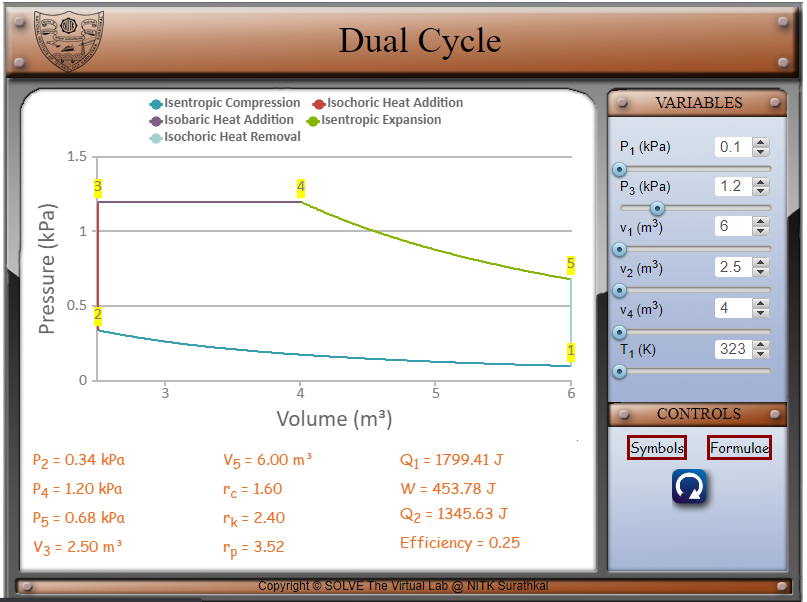
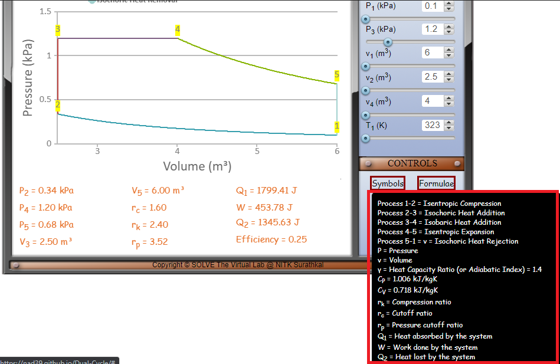
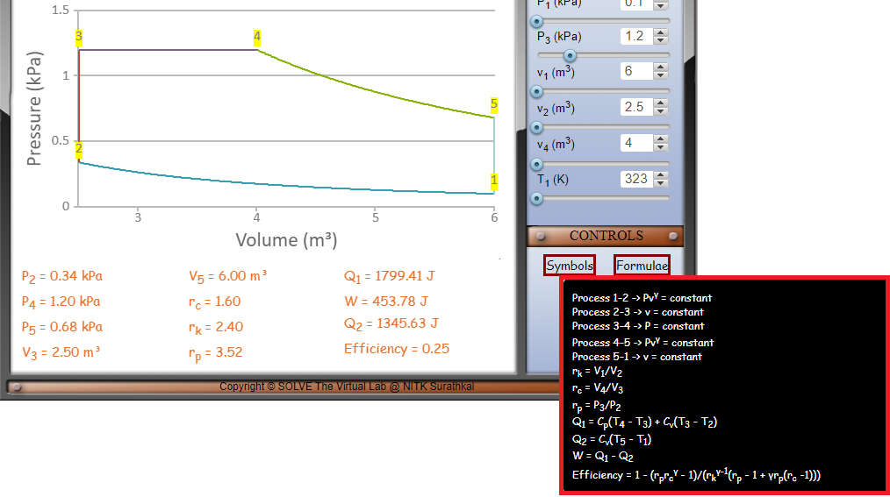
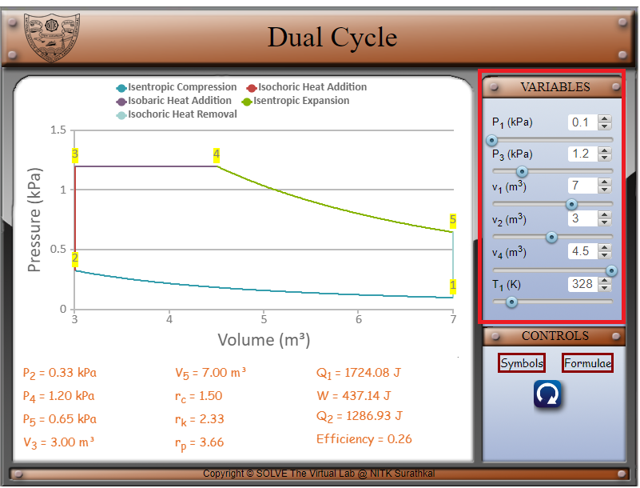
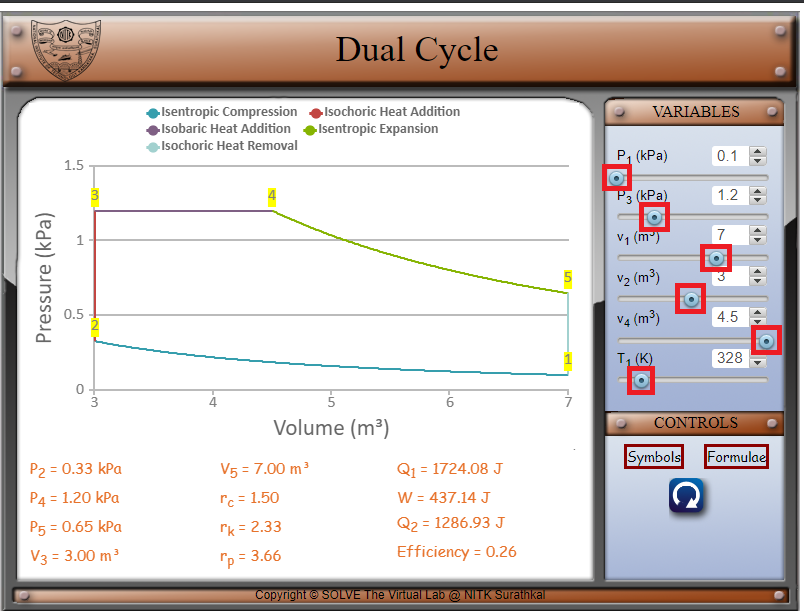
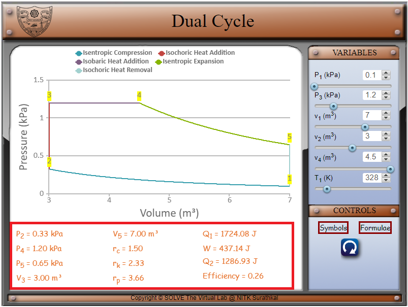
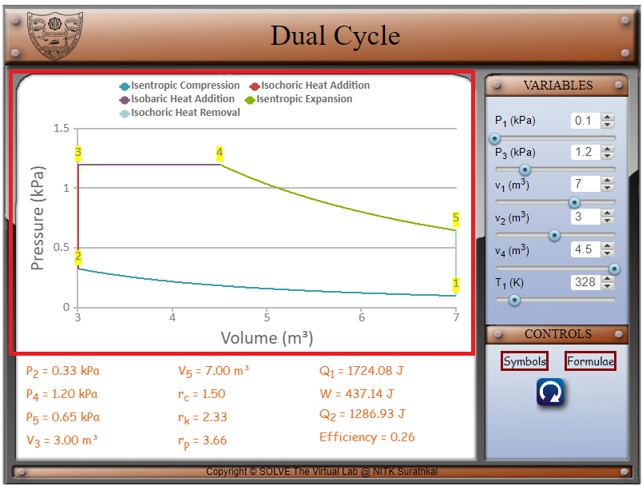

#### These procedure steps will be followed on the simulator

1. In the simulation window, the Dual cycle graph and the piston are displayed.

 

2. The various symbols and the formulae involved in the experiment are displayed in the control panel when the cursor hovers over ‘Symbols’ and ‘Formulae’ respectively.

 

 

3. The parameters of the system can be changed by changing the variables as shown below. 

 

4. Move the sliders’ knobs to vary the pressures P1 and P3, the volumes v1 and v3 and gamma. P1 can be varied from 0.1 to 0.25 kPa. P3 can be varied from 1.1 to 1.5 kPa. V1 can be varied from 6 to 7.5 m3. V2 can be varied from 2 to 3.5 m3. V4 can be varied from 4 to 5 m3. T1 can be varied from 323 to 252 K. 

 

5. P2, P4, P5, v3, v5, the compression ratio rk, the cut-off ratio rc, the pressure cut-off ratio rp, Q1, W, Q2 and the efficiency are displayed at the bottom. 

 

6. Visualize the change in the graph as the various parameters are changed.

 
