## Storyboard (Round 2)

Experiment: Dual Cycle

**1. Story Outline**:

Dual cycle is a thermodynamics cycle developed by the engineer Gustav Trinkler. It is a combination of the Otto cycle used for SI engines and the Diesel cycle used for CI engines. In this cycle, the combustion takes place partially over an isochoric process and partially over an isobaric process to ensure that the fuel combustion takes place completely.

The various processes involved are explained below:

1-2 - This is the isentropic compression phase, where the gas is compressed by the piston as it goes up.

2-3 - This is the constant volume heat addition, where the gas partially undergoes combustion. The pressure variation in this process is known as the explosion ratio.

3-4 - This is the constant pressure heat addition, where the combustion of the air-fuel mixture continues to take place. In this process, the piston moves towards V4 doing work. This is the power stroke.

4-5 - This is the isentropic expansion phase, where the gas is expanded adiabatically in a reversible manner as the piston moves towards the bottom dead centre, and the gas does work on the surroundings. This also contributes to the power stroke.

5-1 - This is the constant volume heat rejection phase, where the heat is rejected to the surroundings as the piston is at the bottom dead centre. The exhaust gases escape through the exhaust valve.

In this experiment, the Dual cycle is demonstrated so that the user can understand how the P-V graph changes as various pressure and volume parameters change.

 **2. Story**:

  **2.1 Set the visual stage description**:

  The experiment consists of the Dual cycle P-V graph. All the buttons and parameters control the right corner of the frame. The variable panel contains sliders for the pressures P1 and P3 and the volumes V1, V2 and V4 and the temperature T1.

  The setup consists of a graph that depicts the Dual cycle. A legend at the top indicates the processes involved in each of the curves.

  By changing the various parameters, the P-V graph changes.

  **2.2 Set User Objectives & Goals**:

  1. Understand the various processes involved in the Dual cycle.
  2. Portray the change in the graph as the parameters are changed.
  3. Calculate the compression ratio, cut-off ratio and the pressure cut-off ratio.
  4. Calculate the heat added, work done and the heat removed.
  5. Calculate the efficiency of the Dual cycle.

  **2.3 Set the pathway activities**:

  1. The initial P1 is taken as 0.1 kPa. 
  2. The initial P3 is taken as 1.1 kPa. 
  3. The initial V1 is taken as 6 m3/kg. 
  4. The initial V2 is taken as 2 m3/kg. 
  5. The initial V4 is taken as 4 m3/kg. 
  6. The initial T1 is taken as 323 K. 
  7. P1 is varied from 0.1 to 0.25 kPa using a slider. 
  8. P3 is varied from 1.1 to 1.5 kPa using a slider. 
  9. V1 is varied from 6 to 7.5 m3/kg using a slider. 
  10. V2 is varied from 2 to 3.5 m3/kg using a slider. 
  11. V4 is varied from 4 to 4.5 m3/kg using a slider. 
  12. T1 is varied from 323 to 353 K using the slider. 

  Change the parameters of the system to understand the behaviour of the Dual cycle.

  **2.4 Set Challenges and Questions/Complexity/variation**

  **2.4.a Questions before simulation**:

  1. The Dual cycle is also known by what other name?

    <ol type="a">
   <li>Mixed cycle</li>
   <li>Trinkler cycle</li>
   <li>Sabathe cycle</li>
   <li>All of the above</li>
   </ol>

   Answer: d

  2. In dual cycle, the heat addition takes place at:

  <ol type="a">
  <li>Constant pressure, then constant volume</li>
  <li>Constant pressure</li>
  <li>Constant volume, then constant pressure</li>
  <li>Constant volume</li>
  </ol>

  Answer: c

  3. The Dual cycle consists of:

  <ol type="a">
  <li>Two isochores and two isothermal curves</li>
  <li>Two isobars and two reversible adiabatic curves curves</li>
  <li>Two isochores, one isobar and two reversible adiabatic curves</li>
  <li>Two isobars, one isochore and two reversible adiabatic curves</li>
  </ol>

  Answer: c

  4. The Dual cycle has heat addition over two processes because:

   <ol type="a">
  <li>This allows fuel more time to combust</li>
  <li>This decreases the load on the engine</li>
  <li>Both a and b</li>
  <li>None of the above</li>
  </ol>

  Answer: a

**2.4.b Questions after simulation**

5. Given that rk = 2.14, rc = 1.29, rp = 2.06, what is the air standard efficiency of the Dual cycle?

<ol type="a">
<li>0.25</li>
<li>0.3</li>
<li>0.45</li>
<li>0.47</li>
</ol>
Answer: a

6. If the Otto, Diesel and Dual cycles have the same compression ratio, how do their efficiencies vary?

<ol type="a">
<li>ηOtto < ηDiesel < ηDual </li>
<li> ηDiesel < ηDual < ηOtto</li>
<li> ηDual < ηOtto < ηDiesel </li>
</ol>

Answer: b

7. If the Otto, Diesel and Dual cycles have the same maximum pressure, how do their efficiencies vary?

<ol type="a">
<li>ηDiesel < ηDual < ηOtto</li>
<li>ηDual < ηOtto < ηDiesel</li>
<li>ηOtto < ηDual < ηDiesel</li>
</ol>

Answer: c

8. If the Otto, Diesel and Dual cycles have the same maximum temperature, how do their efficiencies vary?

<ol type="a">
<li>ηDiesel < ηDual < ηOtto</li>
<li>ηDual < ηOtto < ηDiesel</li>
<li>ηOtto < ηDual < ηDiesel</li>

Answer: c

**2.5 Allow pitfalls: NA**

**2.6 Conclusion**:

The time required to perform the virtual experiment.

The approximate time to understand the procedure and perform the experiment would take about 5 mins. The time required to understand the change in the Dual cycle P-V graph as the parameters are changed is about 5 mins. The time taken to calculate the heat added, work done, heat removed, efficiency and such parameters is about 5 mins. Thus, the total time required to perform the experiment is about 15 mins.

**2.7a Abbreviations:**

1. P1, v1, T1 = Pressure, volume and temperature values at the beginning of Process 1-2
2. P2, v2, T2 = Pressure, volume and temperature values at the beginning of Process 2-3
3. P3, v3, T3 = Pressure, volume and temperature values at the beginning of Process 3-4
4. P4, v4, T4 = Pressure, volume and temperature values at the beginning of Process 4-5
5. P5, v5, T5 = Pressure, volume and temperature values at the beginning of Process 5-1
6. γ = Heat capacity ratio (adiabatic index) = 1.4
7. Cp = Specific heat of air at constant pressure = 1.005 kJ/kg.K
8. Cv = Specific heat of air at constant volume = 0.718 kJ/kg.K
9. rk = Compression ratio
10. rc = Cut-off ratio
11. rp = Pressure cut-off ratio
12. Q1 = Heat absorbed by the system
13. W = Work done by the system
14. Q2 = Heat rejected by the system
15. η = Efficiency of the Dual cycle

**2.7b Equations/formulae:**

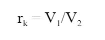 

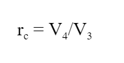 

 

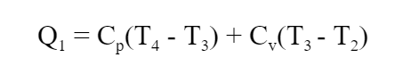 

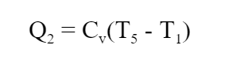 

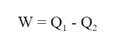 

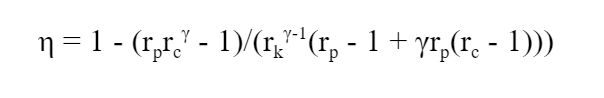 

 

<!-- # Below are the examples added for reference.
# To get mathematical equatios in html format: go to link: https://www.codecogs.com/latex/eqneditor.php and download equations in png format
# In the same link you have option to download equation as punching

### using png -->
<!--
//markdown syntax -->

<!-- //html syntax

 -->

**3. Flowchart**:

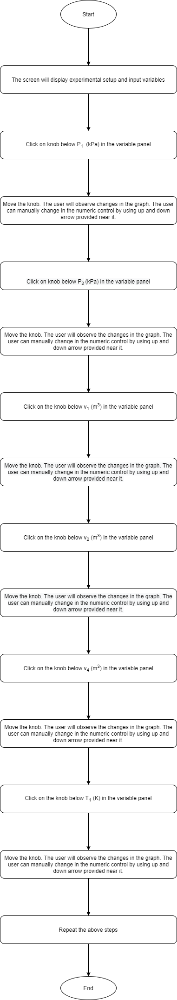

**4. Mindmap**:

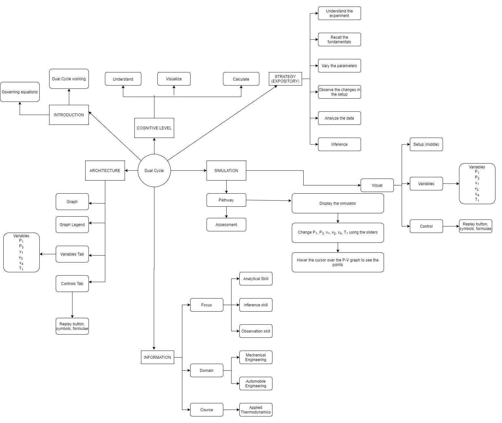

**5. storyboard**:

1. In the simulation window, the Dual cycle graph and the piston are displayed.

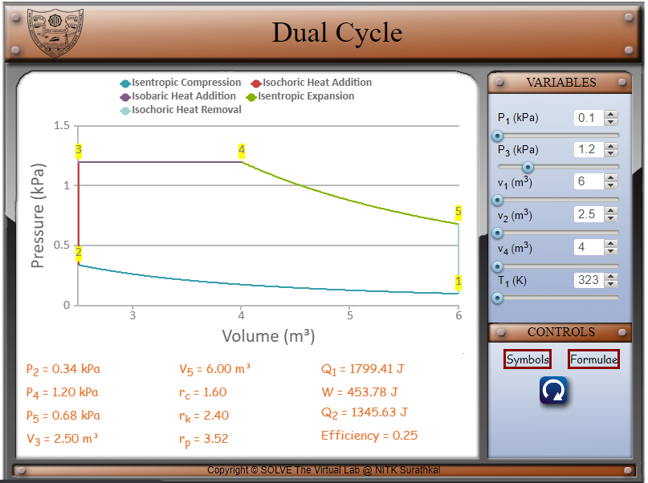 

2. The various symbols and the formulae involved in the experiment are displayed in the control panel when the cursor hovers over ‘Symbols’ and ‘Formulae’ respectively.

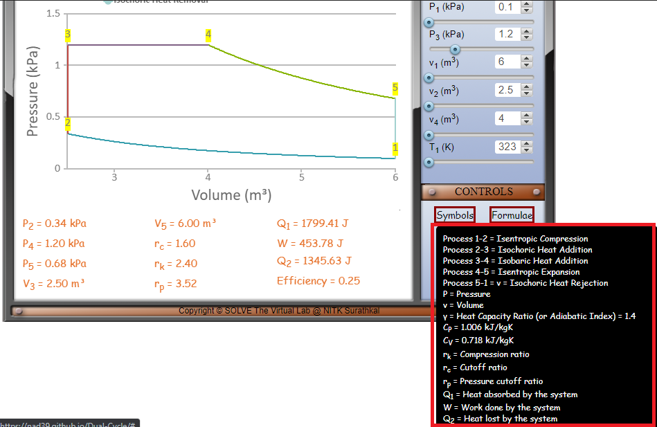 

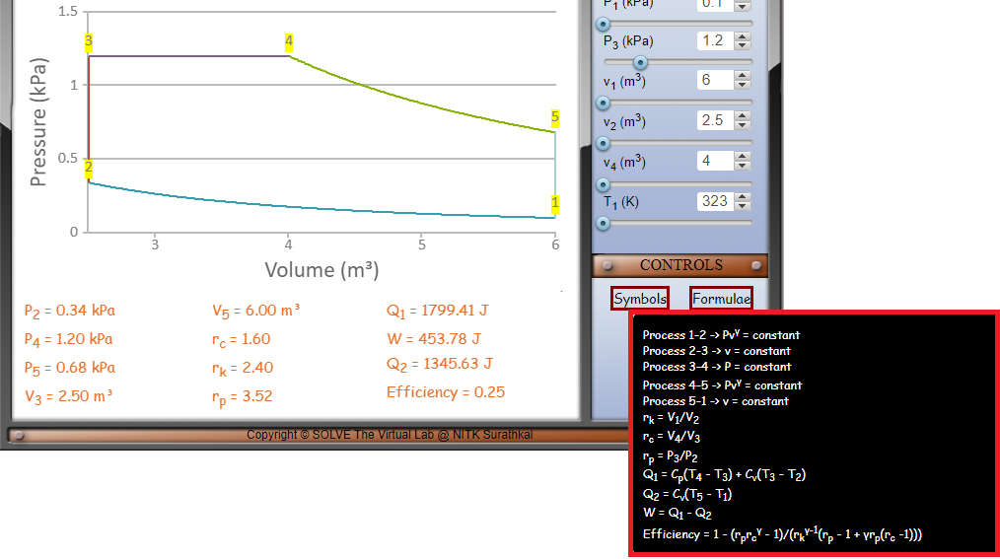 

3. The parameters of the system can be changed by changing the variables as shown below. 

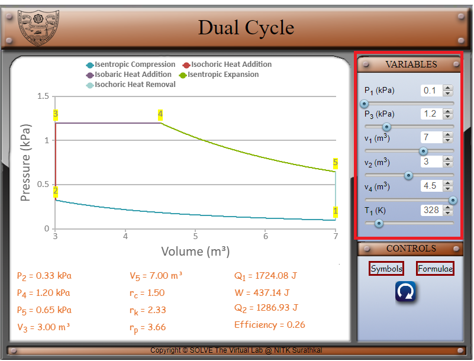 

4. Move the sliders’ knobs to vary the pressures P1 and P3, the volumes v1 and v3 and gamma. P1 can be varied from 0.1 to 0.25 kPa. P3 can be varied from 1.1 to 1.5 kPa. V1 can be varied from 6 to 7.5 m3. V2 can be varied from 2 to 3.5 m3. V4 can be varied from 4 to 5 m3. T1 can be varied from 323 to 252 K. 

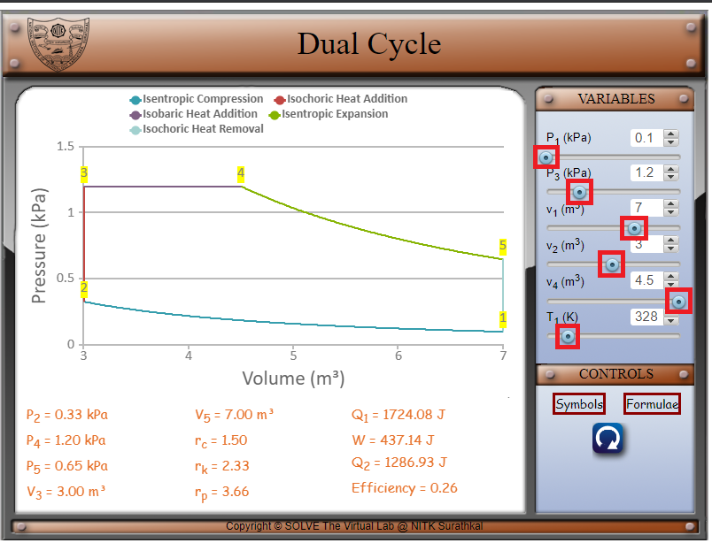 

5. P2, P4, P5, v3, v5, the compression ratio rk, the cut-off ratio rc, the pressure cut-off ratio rp, Q1, W, Q2 and the efficiency are displayed at the bottom. 

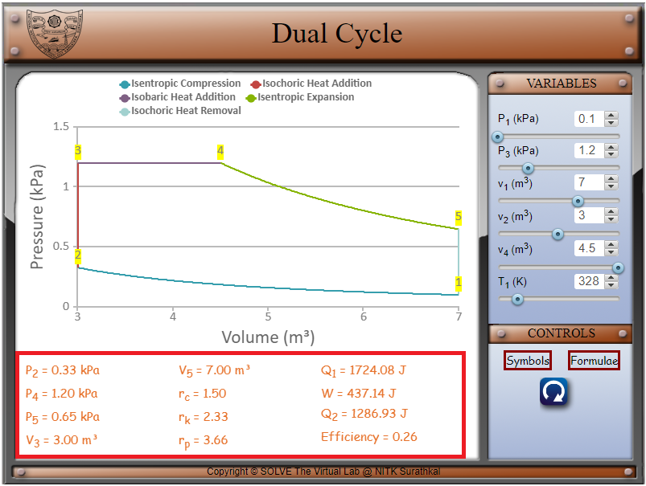 

6. Visualize the change in the graph as the various parameters are changed.

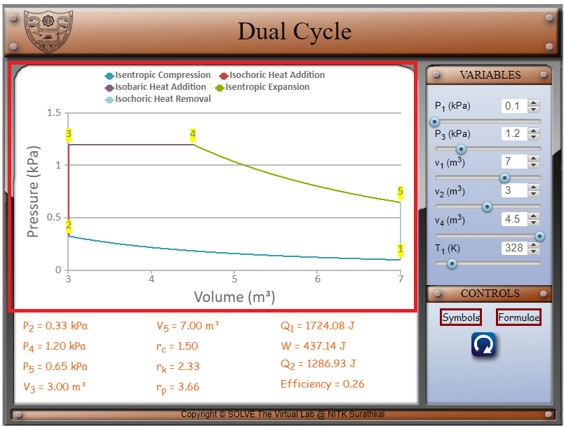 

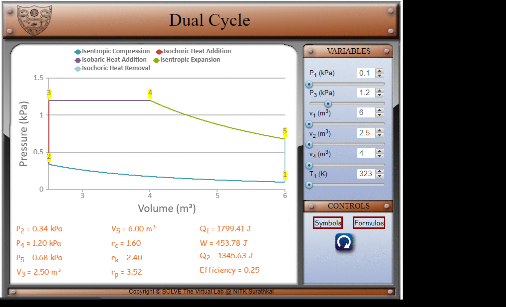

**6. References**:

Basic and Applied Thermodynamics - P.K. Nag
Thermodynamics: An Engineering Approach - Yunus A Cengel, Michael A Boles
